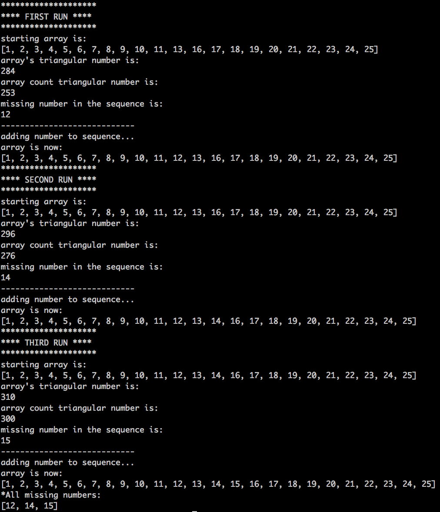

## Find The Missing Number

##### _The purpose of this program is to take an array and find the missing numbers in a sequence of numbers (by 1s). The current build only runs a script to show the process in which it uses to find the missing numbers in the sequence. The last method run will output an array containing all of the missing numbers in the sequence_

